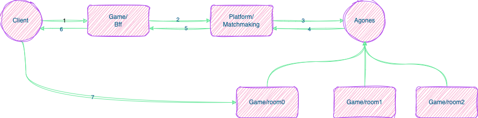
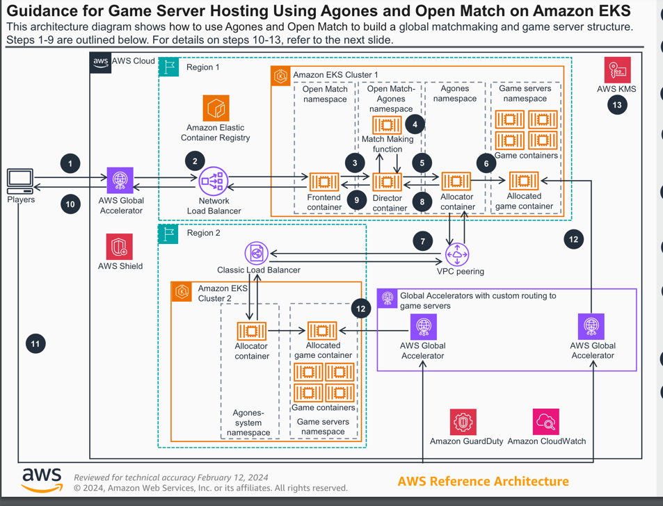

# 房间服务器的实现

## 介绍

* 大世界/大厅是一个大的房间，持久存在，可以容纳很多玩家(100-3000)，玩家可以在这里自由移动，聊天，组队等。
* 战斗房间是一个小的房间，一般是2-100人，玩家在这里进行战斗，比如FPS，MOBA等游戏。
* 源码参考：[Room service](https://github.com/moke-game/game/tree/main/services/room)

## 房间服务器进入流程:

## 同步方式：

* 大厅/大世界: 状态同步，因为大厅和大世界属于持久存在的房间类型，帧同步的帧数据量太大，不适合这种场景
* 战斗房间: 帧同步，因为战斗房间是短时间内的战斗，帧同步可以保证玩家的操作同步，开发速度快，但是需要考虑同步数据量和延迟问题

## 核心技术实现

* 碰撞检测和寻路: 碰撞检测简单的轴对齐可以使用[AABB算法](https://zhuanlan.zhihu.com/p/35321344)
  ，寻路可以考虑[navmesh](https://www.wikiwand.com/en/Navigation_mesh)
* 如果地图很大，人数过多可以采用[AOI算法](https://blog.csdn.net/weixin_28999381/article/details/129665607)
  来划分区域，减少同步数据量和计算量。
* AI: 如果有NPC，可以使用有限状态机或者行为树来实现

## 房间服务器管理：

* 负载均衡，可以采用[etcd](https://etcd.io/)/[consul](https://www.consul.io/)/[zookeeper](https://zookeeper.apache.org/)
  等来管理游戏房间服务
    * 因为房间服务器一般是有状态的服务，需要把指定玩家路由到指定的服务器上，所以需要实现对应的一致性hash算法
* [agones](https://agones.dev/site/)来管理和分配房间服务器(本教程采用的就是这种方式)
    * 附加了房间服务的自动扩缩容功能
    * 通过配置文件来管理房间服务器生命周期
    * 需要基于k8s来部署服务
    * [openmatch](https://open-match.dev/site/)来实现房间的匹配(可选的)

## 房间服务器的实现：

* 一个服务器可以开多个房间，每个房间采用[actor模式](https://chuquan.me/2023/01/15/actor/).
* 每个房间拥有一个主Update循环，用于处理房间内的逻辑和数据同步
* 每个房间管理自己的玩家，NPC，怪物等，相当于一个单线程的游戏服务器

### 房间服务器的全球加速：

房间服务器一般同步数据量比较大，如果玩家分布在全球各地，可能会有较大的延迟，这里可以采用[aws global accelerator](https://aws.amazon.com/cn/global-accelerator/)

这里使用aws官方给的[解决方案:](https://aws.amazon.com/cn/solutions/guidance/game-server-hosting-using-agones-and-open-match-on-amazon-eks/)   

