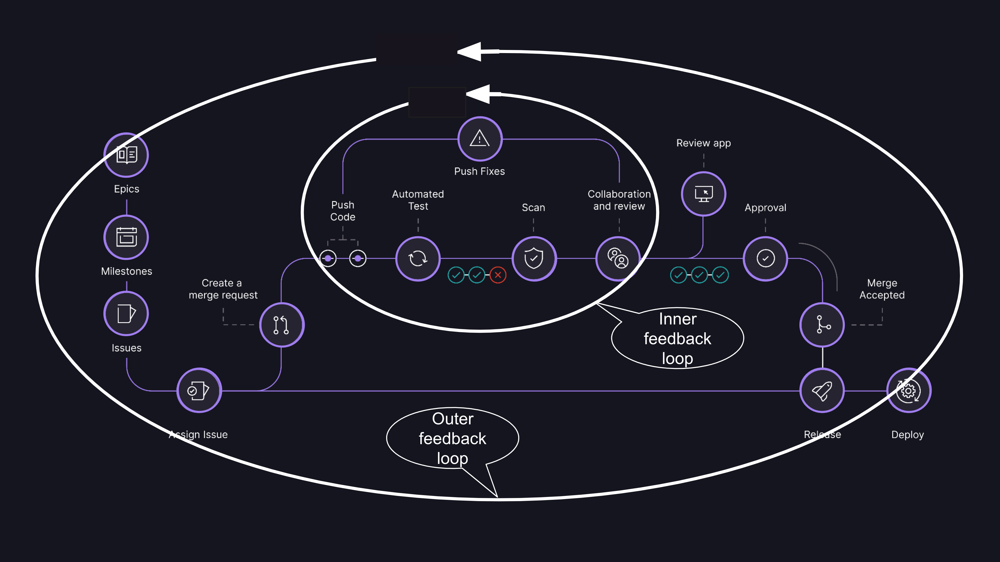

# 规范开发流程

合理规范的开发流程，可以有效提高开发进度，保证产出质量.
## 说明

Github 和Gitlab 合并请求叫法不一样，Github 叫`pull request`，Gitlab 叫`merge request`，下面统一称为`pull request`。

## 流程图：
  
## 开发流程

1. 创建指定需求的`issues`，评论里面附加相关的策划描述文档连接，以及相关UML设计文档等
2. 针对当前`issues` 创建针对性的 `branch`
3. 本地拉取`branch`，开发完成后，提交代码到`branch`(注意：长周期的功能要定期去merge `main` 分支)
4. 提交`pull request`, 指定相关的`reviewer`，`assignee`
5. `reviewer` 审核代码，通过后合并代码到`main`分支
6. 功能开发完成

## 发布流程

1. 在当前git节点上创建`tag`, 命名规范跟随版本号`v1.0.0`
2. 之后可以基于`tag`创建`docker`镜像，发布到`harbor`上,镜像版本号跟随`tag`版本号
3. 发布完成后，通知相关人员测试

## 补丁修复流程
1. git 切到需要修改的补丁版本 `tag`
2. 基于这个`tag`创建`branch`，命名规范`patch-v1.0.0`
3. 本地拉取`branch`，开发完成后，提交代码到`branch`
4. 提交`pull request`, 指定相关的`reviewer`，`assignee`
5. 基于 `patch-v1.0.0` 创建新的`tag`，命名规范`v1.0.1`
6. 之后可以基于`tag`创建`docker`镜像，发布到`harbor`上,镜像版本号跟随`tag`版本号
7. 发布完成后，通知相关人员测试
8. 合并`patch-v1.0.0`  `main` 分支
9. 在下一次版本v1.1.0发布后删除`patch-v1.0.0` 分支

## 参考文档
* [gitlab-flow](https://about.gitlab.com/blog/2023/07/27/gitlab-flow-duo/)
 