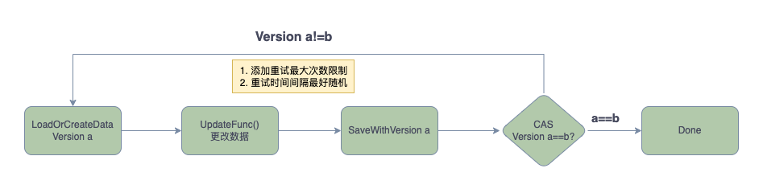

# 数据的一致性保证

在分布式系统中，数据的一致性是一个非常重要的问题，本文将介绍一下基于version的一致性保证的实现。

### 你需要先了解

* Golang 语言基础
* [CAS原理](https://en.wikipedia.org/wiki/Compare-and-swap)
* [MongoDB](https://www.mongodb.com/)

### 什么情况下需要保证数据的一致性？

分布式系统中，有一个共享的数据，多个客户端同时对这个数据进行读写，那么就需要保证这个数据的一致性。

### 一致性保证的方式

* 悲观锁：比如数据库的行锁、表锁、页锁等(会阻塞其他请求)
* 乐观锁：比如CAS(Compare And Swap)原子操作(不会阻塞其他请求) 推荐
* 两阶段提交：比如数据库的事务(会阻塞其他请求)

### 乐观锁的实现

乐观锁的实现方式有很多，这里我们介绍一种基于version的实现方式，这里采用的是MongoDB的实现方式。

1. 每个文档都有一个version字段，每次更新文档的时候，version+1
2. 更新文档的时候，需要带上version，如果version不匹配，说明文档已经被其他客户端更新，需要重新读取文档
3. 重复2，直到更新成功(这里要加上重试次数限制，防止死循环，每次重试需要随机等待一段时间，防止多个客户端同时重试，造成雪崩)

### 流程图


### 代码实现

```go
    // 最大重复次数
    const MaxRetries = 5

func (d *DocumentBase) doUpdate(f func() bool, u func() error) error {
	for r := 0; r < MaxRetries; r++ {
		if f() {
			if err := u(); err == nil {
				return nil
			} else {
				time.Sleep(time.Millisecond * time.Duration(rand.Float32()*float32(r+1)*5))
				d.cache.DeleteCache(d.Key)
				if err := d.Load(); err != nil {
					// a failed load is a real error
					return err
				}
			}
		} else {
			return nerrors.ErrUpdateLogicFailed
		}
	}

	return nerrors.ErrTooManyRetries
}

func (d *DocumentBase) Update(f func() bool) error {
	if err := d.doUpdate(f, func() error {
		return d.Save()
	}); err != nil {
		return err
	} else {
		return nil
	}
}
```


