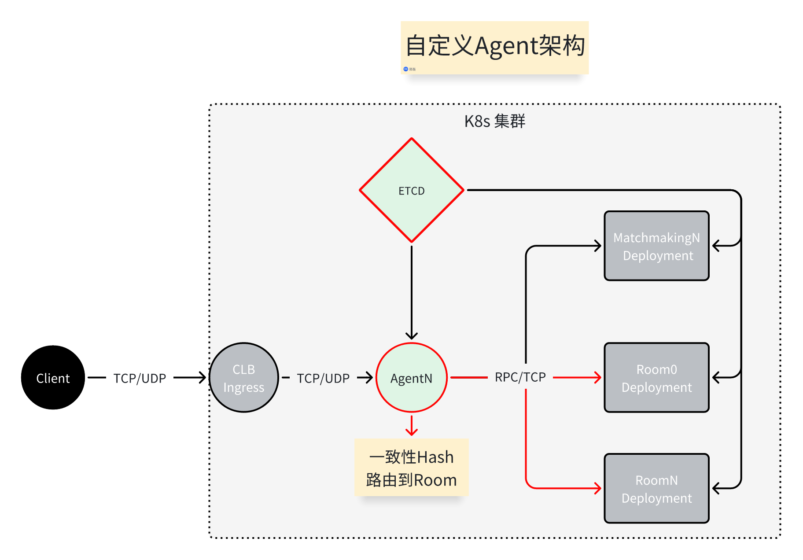
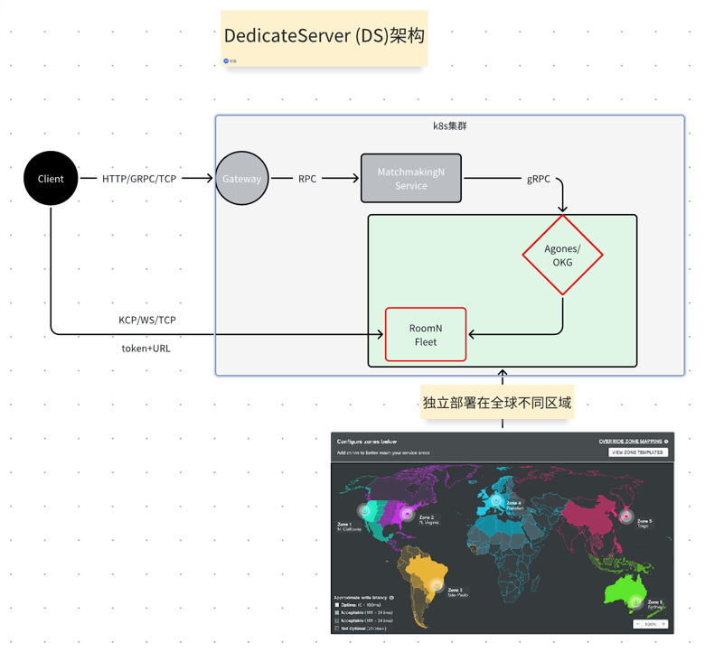

# 有状态服务的管理

在游戏服务器中，一般`战斗服务`,`大世界服务`需要实现为有状态的TCP/UDP服务，
这些服务需要维护玩家的状态，比如玩家的位置，状态，属性等，如何管理这些服务是一个很重要的问题。

## 有状态服务的特点:

1. 数据操作频繁，会把玩家数据加载到服务器内存中进行操作，故而称为有状态服务
2. 一般采用房间制(actor模式)
3. `战斗服务` 房间一般有时效性，比如战斗结束后，房间会被销毁，一般采用lockstep(帧同步)方式
4. `大世界服务` 房间一般是永久的，一般采用State Synchronization(状态同步)方式

## 如何管理？

### 自定义Agent管理

需要自定义实现`Agent`服务用来管理有状态服务，比如负载均衡，消息转发等等

#### 必要的服务:

* 服务发现(consul,ETCD,nacos等等)，用于有状态的服务注册和发现
* `自定义Agent` 服务，用于管理有状态服务的负载均衡，消息转发等等

#### 拓扑图:

### Dedicated Server 管理(推荐)

采用云原生提供的一些公共服务来管理有状态服务，比如`Agones`/`OpenKruiseGame`等服务，
有状态的服务可以单独部署在全球不同地区，比较灵活，提供了很多的管理策略，自动阔所容等等。

#### 必要的服务:

* `Agones`/ `OpenKruiseGame` 等服务，用于管理状态服务的生命周期

#### AWS 最佳实践：
https://aws.amazon.com/cn/solutions/guidance/game-server-hosting-using-agones-and-open-match-on-amazon-eks/

#### 拓扑图:

