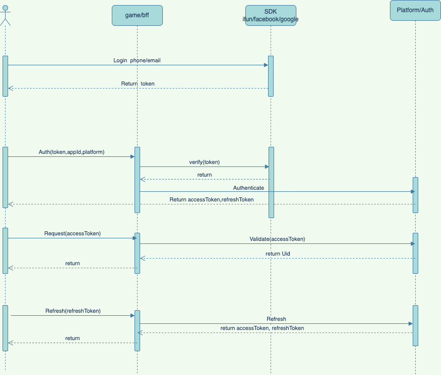

# 基于token认证机制 [Auth](https://github.com/moke-game/platform/tree/main/services/auth)

微服务的安全主要包含两种方式：面向用户的[基于token认证机制](https://www.okta.com/identity-101/what-is-token-based-authentication/)
,和面向服务的[mTLS](https://www.cloudflare.com/zh-cn/learning/access-management/what-is-mutual-tls/)
,这里主要介绍面向用户的基于token认证机制。

token认证机制是一种无状态的认证机制，用户在登陆后，会颁发一个token，这个token会携带用户的信息，用于后续的访问和对控制用户访问权限。

## 知识点

* [OAuth2.0协议](https://deepzz.com/post/what-is-oauth2-protocol.html).
* [JWT](https://jwt.io/introduction/)
* [基于token认证机制](https://www.okta.com/identity-101/what-is-token-based-authentication/)

## 为什么需要token认证？

* 微服务中的服务之间的调用，需要校验调用方是否有权限访问当前服务
* 每个服务不需要保存当前session的信息，token里面会携带用户的信息，可以做到无状态访问

## 如何实现？

因为服务间采用grpc通信，所以这里引入[grpc-middleware](https://github.com/grpc-ecosystem/go-grpc-middleware) 去重写grpc的拦截器,
这样可以在每个服务的调用前，校验token是否有效。

```go
// authFunc is a helper function to create a grpc auth interceptor
// that uses the provided authClient to authenticate incoming requests.
func authFunc(authClient siface.IAuthMiddleware) auth.AuthFunc {
return func (ctx context.Context) (context.Context, error) {
  if authClient != nil {
    return authClient.Auth(ctx)
}
return ctx, nil
}
}

func allBut(_ context.Context, _ interceptors.CallMeta) bool {
return true
}

ops := []grpc.UnaryServerInterceptor{
selector.UnaryServerInterceptor(auth.UnaryServerInterceptor(authFunc(authClient)), selector.MatchFunc(allBut)),
}
// add the interceptor ops to the grpc server

```

## 实现的接口

* Authenticate：申请Token，这里会返回一个`access_token`(访问服务的token)和`refresh_token`(用于刷新已有的token)
* RefreshToken：刷新token，这里会返回一个新的`access_token`和`refresh_token`
* ValidateToken：验证token是否有效，用于每个微服务来这里校验token是否有效
* ClearToken：清除token，用于用户登出

## 获取token流程


    

