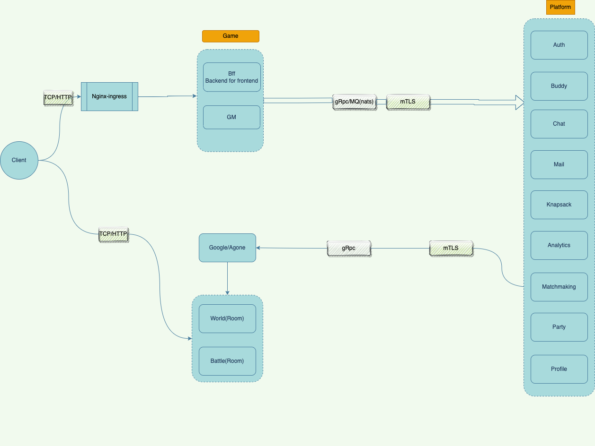

# 拆分服务
主要把服务拆分两个服务组：[Game](https://github.com/moke-game/game) 和 [Platform](https://github.com/moke-game/platform),分别用两个git仓库管理
> 注意：服务拆分需要在演化中进行，不要一开始就拆分得太细，否则会增加维护成本
#### [Game](https://github.com/moke-game/game)
游戏业务服务，主要处理游戏相关的业务逻辑，包括以下服务：
* bff(backend for frontend):  前置聚合服务，主要处理前端请求，聚合`Platform`中的服务以提供复杂的功能
* room:  游戏房间服务，主要处理游戏房间逻辑，包括大厅，战斗等服务
* gm : 后台管理服务，主要聚合`Platform` 中的`Private`类型服务，提供后台管理功能
#### [Platform](https://github.com/moke-game/platform)
中台服务,包含许多公共服务,可以慢慢演化：
* auth: token认证服务器，提供用户认证服务,这里主要采用jwt token。[为什么需要token认证?](https://www.okta.com/identity-101/what-is-token-based-authentication/)
* buddy: 好友服务,管理好友关系
* chat: 聊天服务,提供聊天功能
* knapsack: 背包服务,提供背包功能
* leaderboard: 排行榜服务,提供排行榜功能
* mail: 邮件服务,提供邮件功能
* matchmaking: 匹配服务,提供匹配功能,这里可以对接[openMatch](https://open-match.dev/site/)
* party: 组队服务,提供组队功能
* profile: 玩家信息服务,提供玩家信息功能

## 服务拓扑图

